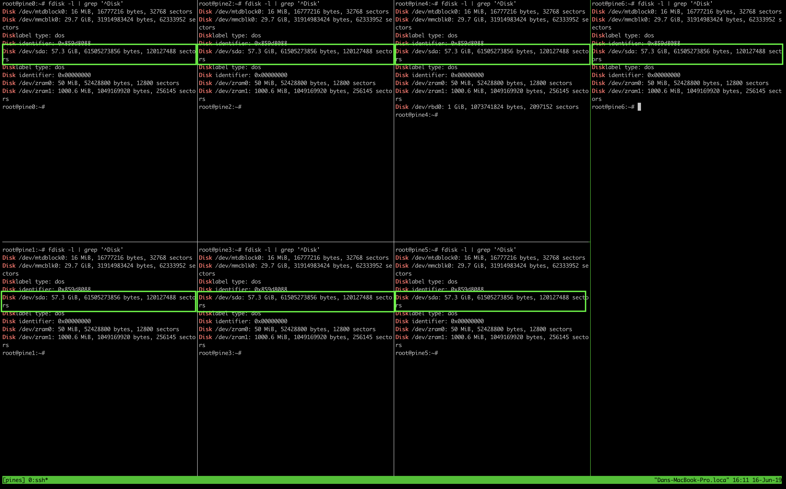
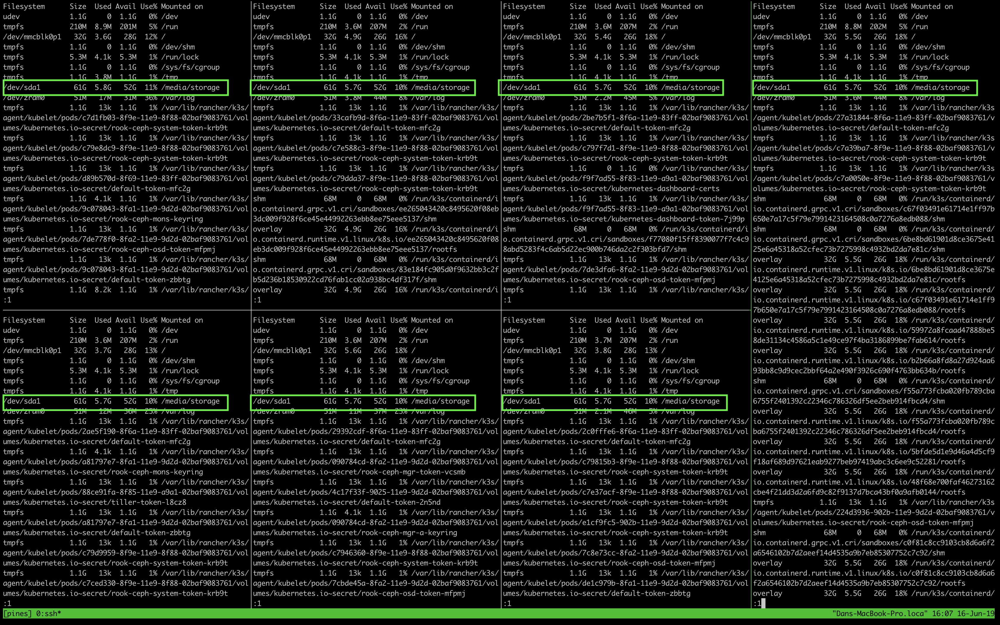
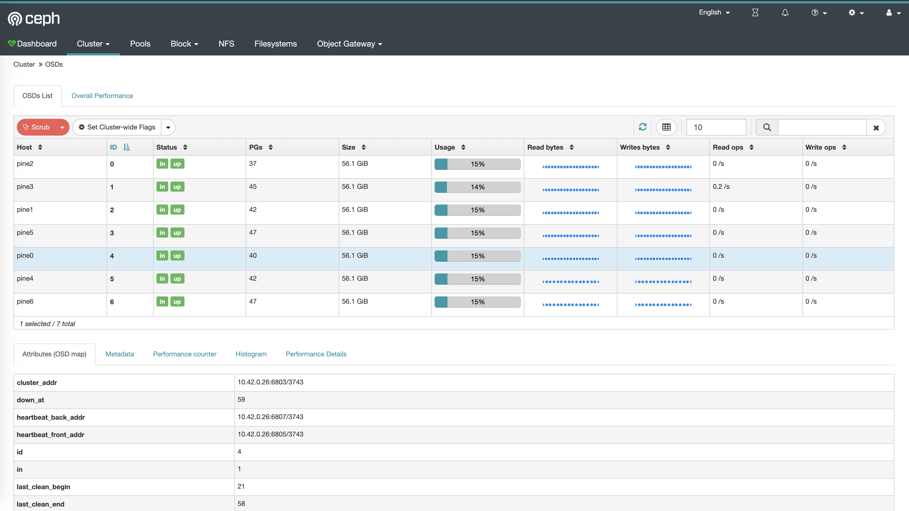

# Rook-ceph

## Creating a dynamically provisioned, replicated storage pool using USB flash drives

I could have chosen NFS, of using hostDir for volumes, but that did not seem good enough. Since ceph has arm64 support, it made sense to give it a try.

Let's start with formatting the drives:

> It is recommended to run these commands on all nodes using tmux.

Find the /dev of the disk drives: `fdisk -l | grep '^Disk'`



Since the USB drives are available at /dev/sda, we will format them to ext4, create a directory where we intend to mount them and eventually mount them.

```
mkfs.ext4 /dev/sda1
mkdir /media/storage
mount /dev/sda1 /media/storage
df -H | less
```



To make the mount survive reboots, fstab has to be edited. This is still possible to do while all the windows are synchronized `vim /etc/fstab`

Insert this line at the end:
```
/dev/sda1               /media/storage           ext4    defaults        1 2
```

Now the storage will survive reboots. Let's get to the ceph installation.

```
helm repo add rook-release https://charts.rook.io/release
helm install --namespace rook-ceph rook-release/rook-ceph
```

The next step is to install the [Ceph Cluster CRD](https://github.com/rook/rook/blob/master/Documentation/ceph-cluster-crd.md#ceph-cluster-crd).

```
kubectl create -f yamls/cephcluster.yaml
```

For this project, I chose to use [ceph block pool](https://github.com/rook/rook/blob/master/Documentation/ceph-block.md):

```
kubectl apply -f yamls/blockstorage.yaml
```

Once that is setup, it makes sense to tag our ceph block pool as the default StorageClass:

```
kubectl patch storageclass rook-ceph-block -p '{"metadata": {"annotations":{"storageclass.kubernetes.io/is-default-class":"true"}}}'
```

> Note, some of these steps might take a while to complete. Make sure to check kubectl get pods --all-namespaces to see the progress.

Ceph comes with a [built-in dashboard](https://github.com/rook/rook/blob/master/Documentation/ceph-dashboard.md), and it seemed like a good idea to have it deployed, you can grab the password using:

```
kubectl -n rook-ceph get secret rook-ceph-dashboard-password -o jsonpath="{['data']['password']}" | base64 --decode && echo
```

Create a port-forward using:

```
kubectl port-forward -n rook-ceph svc/rook-ceph-mgr-dashboard 8443
```

Username is `admin`, the dashboard will be available at: https://localhost:8443/#/cephfs

> Note, the main dashboard page does not work well for me, but I am able to retrieve the pool status at https://localhost:8443/#/osd. If you would like to know more about the status of your storage pool, the [Rook Toolbox](https://github.com/rook/rook/blob/master/Documentation/ceph-toolbox.md) worked out great for me.



Next: [Example Application](05-example-application.md)